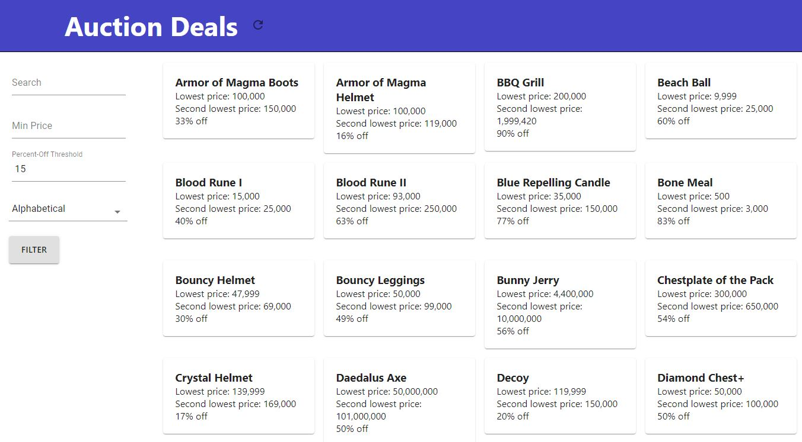

# Hypixel Skyblock Auction House Deal Finder (Deprecated)

### Repository is deprecated and has numerous dependency security concerns.

Utilizes Hypixel API to capture present auction house entries and calculate and project the biggest deals currently on sale. Updates once a minute.

Consists of a Python script to fetch all pages of auction data from official Hypixel API, api.hypixel.net. Script runs every minute at :27 to start fetching the moment the API is updated. Each page is fetched and all auction item entries are mapped to a more usable format before being inserted into MongoDB collection. Time to fetch all pages (usually around 50) fluctuates based on Hypixel server response times, though is usually between 10-30 seconds. Performance was important in making these scripts as fetching and entry into database must be completed before the subsequent minute in order to provide highest resolution portrayal of current ingame market. Flask was used for basic backend RESTful service. React and MaterialUI was used to display the "deals".

Can be manually refreshed using refresh icon in top navbar. Items can be filtered and sorted with the given selectors on the left sidebar.

